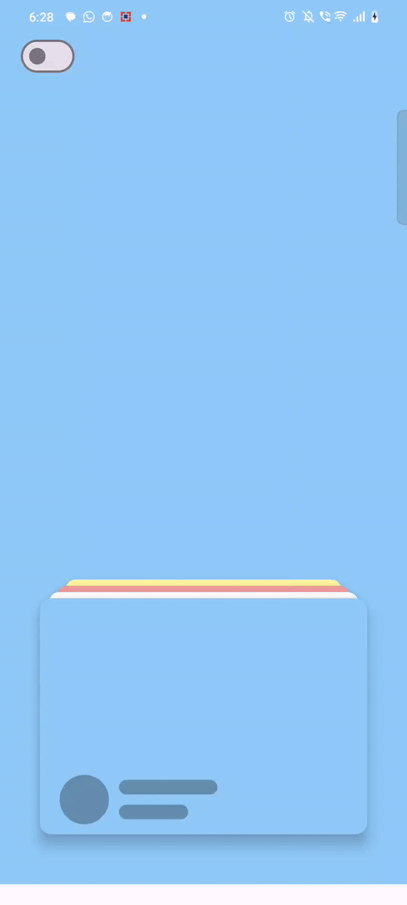

<h1 align = "center">
  Compose Arena 🏆
</h1>
  <p align="center">
This project helped us learn how to use jetpack composes to build complex layouts in the simplest way possible.
</p>
<p align="center">
  <a href="https://opensource.org/licenses/Apache-2.0"></a>
  <a href="http://developer.android.com/index.html"></a>
</p>

<p align="center">
  
</p>

💻 Requirements
------------
To try out these sample apps, you need to use [Android Studio](https://developer.android.com/studio).
You can clone this repository or import the
project from Android Studio following the steps
[here](https://developer.android.com/jetpack/compose/setup#sample).


🧬 Animations
------------
 <table>
        <tr>
            <td><a href="https://github.com/sparrow007/Jetpack-Compose-Arena/blob/bd6e948a595728a8a45ad2adfba5e82dcb957ed4/app/src/main/java/com/example/composelearning/animation/carousel/magazine/MagazineApp.kt#L1">Card Stack Swipe Animation</a></td>
            <td><a href="https://github.com/sparrow007/Jetpack-Compose-Arena/blob/bd6e948a595728a8a45ad2adfba5e82dcb957ed4/app/src/main/java/com/example/composelearning/animation/SwipeDragComposable.kt#L1">Card Stack Flip Animation</a>
</td>
            <td><a href="https://github.com/sparrow007/Jetpack-Compose-Arena/blob/bd6e948a595728a8a45ad2adfba5e82dcb957ed4/app/src/main/java/com/example/composelearning/animation/book/BookComposeVIew.kt#L1">Book Open Animation</a>
</td>
        </tr>
        <tr>
           <td><p align = "center"> </p></td>
            <td><p align="center">  </p></td>
           <td><p align="center">  </p></td>
        </tr>
       <tr>
            <td><a href="https://github.com/sparrow007/Jetpack-Compose-Arena/blob/bd6e948a595728a8a45ad2adfba5e82dcb957ed4/app/src/main/java/com/example/composelearning/animation/colorswaft/ColorSwaftComposable.kt#L1">Card Stack Spin Animation</a>
</td>
            <td><a href="https://github.com/sparrow007/Jetpack-Compose-Arena/blob/bd6e948a595728a8a45ad2adfba5e82dcb957ed4/app/src/main/java/com/example/composelearning/animation/carousel/cardstack/AdsCardShow.kt#L1">Card Stack Spin Animation</a>
</td>
         <td><a href="https://github.com/sparrow007/Jetpack-Compose-Arena/blob/c33a73bc14b184e8fc87ef7f6aee582cd6b5efe3/app/src/main/java/com/example/composelearning/customlayout/CarouselCustomLayout.kt#L1">Custom Layout Carousel Animation</a>
</td>
        </tr>
       <tr>
           <td><p align = "center"> </p></td>
            <td><p align="center">  </p></td>
           <td><p align="center">  </p></td>
        </tr>
  </table>

## Contribute 🤝
If you like the project and somehow wants to contribute, you are welcome to contribute by either submitting issues, refactor, pull request Thankyou.  

## Find this repository useful? ❤️
Support it by joining __[stargazers](https://github.com/sparrow007/Jetpack-Compose-Arena/stargazers)__ for this repository. :star: <br>
 And __[follow](https://github.com/sparrow007)__  me for next creation 🤩

## License
```
Copyright 2024 Sparrow007

Licensed under the Apache License, Version 2.0 (the "License");
you may not use this file except in compliance with the License.
You may obtain a copy of the License at

    https://www.apache.org/licenses/LICENSE-2.0

Unless required by applicable law or agreed to in writing, software
distributed under the License is distributed on an "AS IS" BASIS,
WITHOUT WARRANTIES OR CONDITIONS OF ANY KIND, either express or implied.
See the License for the specific language governing permissions and
limitations under the License.
```
